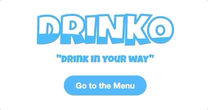

# NEXTJS PROJECT | DRINKO

<p align="center"></p>


## HOW TO USE

### 1. Install all dependencies: 
```bash
$ yarn 
# or 
$ npm install
```

### 2. Run the project in dev mode:
```bash
$ yarn dev
# or
npm run dev
```

### 3. Open Browser
Open browser at `http://localhost:3000/`


## PROJECT OVERVIEW

You own a drink bar with self-order through a​ **t​ablet as a menu**.​ <br />

You want your customer to have a drink experience **that starts from selecting a favourite ingredient.**<br />

Customers can choose one ingredient and have an overview of **suggested drinks that matches**, then they can make an order directly from the tablet.<br />

You will use data from [TheCocktailDB.com](https://www.thecocktaildb.com/api.php)


### Main User Stories
| US | Description |
| :------------ | :----------- |
| **#1**: |  As a user I want to search drinks from a selection of ingredients that fit my tastes. |
| **#2**: | As a user I want to make an order from the found drinks so that i can get my drinks. |
| **#3**: | As a user I want to review my order to make sure it's right. |

> We will not set up any acceptance criteria for these stories, you may try to
imagine the minimum functionalities to create a good experience.

### Technical Requirements

> React Project build with **NextJS** Framework

- [x] Create at least two different routes with a cool transition between them.
- [x] We want to prefetch cocktails at build time.
- [x] Create at least a custom hook.
- [x] Must be responsive.

### Evaluation Goals

- :zap: Performance
- :european_castle: Method in architecture implementation
- :jigsaw: Components architecture
- :link: Organization and structure of project and code
- :thought_balloon: Thinking out of the box
- :recycle: User experience